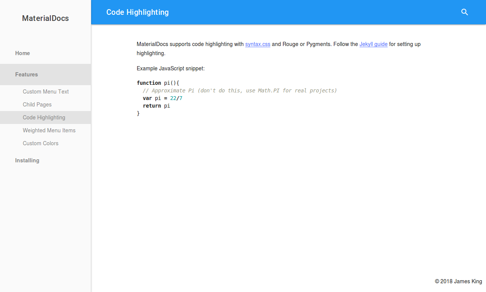

# MaterialDocs

**View this theme on [ThemeJekyll](https://themejekyll.github.io/theme/materialdocs/)**



MaterialDocs is a material two-column Jekyll theme designed for documentation websites.  It is built with [Material Design Lite](https://getmdl.io).

## Standard Installation

Add this line to your Jekyll site's `Gemfile`:

```ruby
gem "jekyll-materialdocs"
```

And add this line to your Jekyll site's `_config.yml`:

```yaml
theme: jekyll-materialdocs
```

And then execute:

    $ bundle

Or install it yourself as:

    $ gem install jekyll-materialdocs

## Using with GitHub Pages

MaterialDocs is compatible with [Jekyll Remote Theme](https://github.com/benbalter/jekyll-remote-theme).

Add the following to `_config.yml` to enable Jekyll Remote Theme.

```yaml
plugins:
  - jekyll-remote-theme
```

Add the following to `_config.yml` to use MaterialDocs.

```yaml
remote_theme: chromatical/jekyll-materialdocs
```

## Site Options
```yaml
mdl_colors: indigo-pink # a supported Material Design Lite color scheme
copyright: Your Name # will override the copyright notice (default is site title)
search: true # enabled by default, set to false to disable site search
```
MaterialDocs supports changing the color scheme by setting `mdl_colors` in _config.yml to a supported Material Design Lite scheme (e.g. indigo-pink, deep_orange-blue).  Use the [MDL theme builder](https://getmdl.io/customize/index.html) to find color schemes.

## Front Matter Options

MaterialDocs supports a few optional custom values in the YAML front matter.
```yaml
menu: Example Page # will use this as the menu item text instead of title, set to false to remove from menu
parent: index.md # will make this menu item a child of the index.md item
weight: 2 # smaller weights rise to the top of the menu
mdl_colors: deep_orange-blue # override global color scheme for this page
```

## Contributing

Bug reports and pull requests are welcome on GitHub at https://github.com/chromatical/jekyll-materialdocs.

## License

The theme is available as open source under the terms of the [MIT License](https://opensource.org/licenses/MIT).
